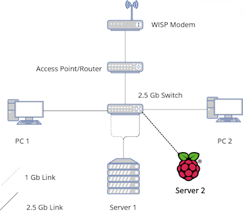

# Network Stack {#Network_Stack}

The first thing I want to talk about is the network stack. I've learned that homelabbing is like 70% services and 30% networking. Without the network there is no way for any of these services to communicate. 



I have internet coming from the ISP piped directly to my router. Then from the router I go directly into an unmanaged 2.5 Gig switch. This connects my two computers and two server to the internet. All links are 2.5 Gig links except for the Pi and one from Server 1. DNS is handled by [Pi-Hole](#DNS_Stack) and [Unbound](#DNS_Stack). DHCP is handled by [Windows Server 2022](#WindowsServer). In order to access all of my services, I use [Nginx](#Nginx) to route all of my service traffic to the proper endpoint. Finally, my mobile devices, such as my phone and laptop, are tunneled in though a private [WireGuard Virtual Private Network](#Wireguard). 

## DNS Stack

In my homelab I have a different DNS's running. The primary DNS is Pi-Hole, an ad-blocking DNS Server that sinks known ad cdn domains. Since the requests for these sites never reach the internet, the website/program is unable to load their ad. Then to handle all requests that are not in the DNS cache we use Unbound. This is a Recursive DNS that we seek out the Authoritative Name Server for the requested Name. We could use Google or Cloudflares DNS server for unknown names but using Unbound will prevent those services from creating profiles on our searches. Finally, we use DuckDNS as our dynamic DNS provider. The main reason I chose this is becuase I was not ready to purchase a domain and use Cloudflare's DDNS service to provide real valid SSL certificates for the Names that I create for the different services on my homelab. 

### Pi-Hole Configuration

First we need to install Pi-Hole. In my homelab I have it directly installed on the hardware instead of being in a container. The main reason for this is due to networking ease. From Pi-Hole's [documentation](https://docs.pi-hole.net/main/basic-install/):

```bash
curl -sSL https://install.pi-hole.net | bash
```

This will download the script via curl and pipe it into a new bash instance. Once you are through the installer, Pi-Hole will tell you that you can access the web interface via `http://pi.hole/admin` or `http://<ip-address-of-os>/admin`. It will also tell you what is the admin password. You can change the password by:

```bash
pihole -a -p <password>
```

To update Pi-Hole:
```bash
pihole -up
```

To update Pi-Hole's blocklist:
```bash
pihole -g
```

Assuming that [Unbound](#unbound_configuration) is already installed and configured, we can go into the admin panel and change the upstream DNS server from whatever was set in the installer to our local Unbound instance. Since we installed both pi-hole and unbound on bare-metal we can just use the address `127.0.0.1#5335`.

### Unbound Configuration

For the most part, you can follow [this guide](https://docs.pi-hole.net/guides/dns/unbound/) on the Pi-Hole Docs website; this will help better understand what a Recursive DNS server does but in short it goes and finds who knows what the IP of a given Domain Name resolves to. The Recursive DNS will go an ask the Autoritative Domain Name Server (the server/s that hold records of TLDs like .com, .net, .org, etc) who the domain belongs to or who may know who the domain belongs to. From their it will recursivly go down until it finds the IP and brings it back up. Typically your router would be set to something like 8.8.8.8 (Google's DNS) or 1.1.1.1 (Maintianed by Cloudflare) or even 9.9.9.9 (Quad9 DNS) for this sort of resolution. 

The Main reason we need this in addition to Pi-Hole is that Pi-holes job is just to cache DNS queries, sinking the domains we ask it to ignore for ad-blocking/privacy purposes. Pi-Hole itself will not resolve DNS queries if it does not know where they are. That is where unbound comes into play. (or any of the other upstream DNS' I mentioned previously.)

You can install unbound straight from apt

```bash
sudo apt install unbound
```

Then create this config file in the directory with the following configuration `/etc/unbound/unbound.conf.d/pi-hole.conf`:

```yaml
server:
    # If no logfile is specified, syslog is used
    # logfile: "/var/log/unbound/unbound.log"
    verbosity: 0

    interface: 127.0.0.1
    port: 5335
    do-ip4: yes
    do-udp: yes
    do-tcp: yes

    # May be set to no if you don't have IPv6 connectivity
    do-ip6: yes

    # You want to leave this to no unless you have *native* IPv6. With 6to4 and
    # Terredo tunnels your web browser should favor IPv4 for the same reasons
    prefer-ip6: no

    # Use this only when you downloaded the list of primary root servers!
    # If you use the default dns-root-data package, unbound will find it automatically
    #root-hints: "/var/lib/unbound/root.hints"

    # Trust glue only if it is within the server's authority
    harden-glue: yes

    # Require DNSSEC data for trust-anchored zones, if such data is absent, the zone becomes BOGUS
    harden-dnssec-stripped: yes

    # Don't use Capitalization randomization as it known to cause DNSSEC issues sometimes
    # see https://discourse.pi-hole.net/t/unbound-stubby-or-dnscrypt-proxy/9378 for 
    # further details
    use-caps-for-id: no

    # Reduce EDNS reassembly buffer size.
    # IP fragmentation is unreliable on the Internet today, and can cause
    # transmission failures when large DNS messages are sent via UDP. Even
    # when fragmentation does work, it may not be secure; it is theoretically
    # possible to spoof parts of a fragmented DNS message, without easy
    # detection at the receiving end. Recently, there was an excellent study
    # >>> Defragmenting DNS - Determining the optimal maximum UDP response size for DNS <<<
    # by Axel Koolhaas, and Tjeerd Slokker (https://indico.dns-oarc.net/event/36/
    # contributions/776/)
    # in collaboration with NLnet Labs explored DNS using real world data from the
    # the RIPE Atlas probes and the researchers suggested different values for
    # IPv4 and IPv6 and in different scenarios. They advise that servers should
    # be configured to limit DNS messages sent over UDP to a size that will not
    # trigger fragmentation on typical network links. DNS servers can switch
    # from UDP to TCP when a DNS response is too big to fit in this limited
    # buffer size. This value has also been suggested in DNS Flag Day 2020.
    edns-buffer-size: 1232

    # Perform prefetching of close to expired message cache entries
    # This only applies to domains that have been frequently queried
    prefetch: yes

    # One thread should be sufficient, can be increased on beefy machines. In reality
    # for most users running on small networks or on a single machine, it should be 
    # unnecessary to seek performance enhancement by increasing num-threads above 1.
    num-threads: 1

    # Ensure kernel buffer is large enough to not lose messages in traffic spikes
    so-rcvbuf: 1m

    # Ensure privacy of local IP ranges
    private-address: 192.168.0.0/16
    private-address: 169.254.0.0/16
    private-address: 172.16.0.0/12
    private-address: 10.0.0.0/8
    private-address: fd00::/8
    private-address: fe80::/10

    # Ensure no reverse queries to non-public IP ranges (RFC6303 4.2)
    private-address: 192.0.2.0/24
    private-address: 198.51.100.0/24
    private-address: 203.0.113.0/24
    private-address: 255.255.255.255/32
    private-address: 2001:db8::/32
```

The most important thing is that we set this to listen on a different port than the default. Since this is also just a DNS server, by default, Unbound will listen on port 53. This is why we set it to 5335, that way it doesn't conflict with Pi-Hole.

## Dynamic DNS with DuckDNS

A dynamic DNS provider will provide us with two things that will help us in the long run:

   1. It will provide a FQDN for my Wireguard server; that way instead of having to remember my IP address and changing the IP every little while, we can just target the one address and never have to worry about it
   2. We can use LetsEncrypt DNS challenges to provide signed certs to our different services. This way when we access something like the Proxmox web interface, we don't have to deal with Self-Signed Certificates. There is nothing wrong inherently with Self-Signed Certs, it's just web browsers inherently do not trust them, and make you jump through hoops to access these web interfaces.

### Establishing our Domain

The first thing we need to do is register an account on DuckDNS, luckily we can just sign in with github or a number of services. Once you have an account, make sure to register a subdomain. On the free teir, we get access to 5 subdomains. The main drawback to a service like DuckDNS is we are tied to their domain. If we then want to add our own subdomains to the subdomain that DuckDNS provides (IE: `pihole.<your-subdomain>.duckdns.org`) your URLs look pretty long. An alternative is to purchase your own domain through something like Cloudflare. The upside is you have more control over your Domain, but the downside is that Cloudflare is not free and neither is your domain. They arn't terribly expensive, but its just another thing to deal with. Now that we have both your Subdomain and your token we need to update your current IP. 

### Keeping your IP up-to-date

We can manually update our IP address every time it changes at home, but something that is easier is to do it automatically. Fortunatly, we can use a container maintained by [LinuxServer](https://docs.linuxserver.io/images/docker-duckdns/). This lightweight container will check with DuckDNS and verify that they have the right IP address. If they do not, they will update DuckDNS. The following is a docker compose file that has all the variables that I have set:

```yaml
services:
  duckdns:
    image: lscr.io/linuxserver/duckdns:latest
    container_name: duckdns
    network_mode: host #optional
    environment:
      - PUID=<your-PUID>
      - PGID=<your-GUID>
      - TZ=<your-TZ>
      - SUBDOMAINS=<your-SUBDOMAIN> 
      - TOKEN=<your-duckdns-token>
      - LOG_FILE=false
    restart: unless-stopped
```

I would reccomend setting your PUID/GUID to be your user profile, it will make access a lot easier.