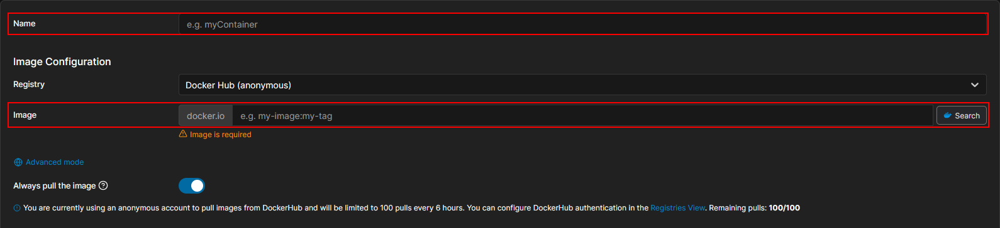
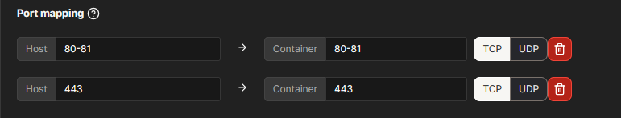
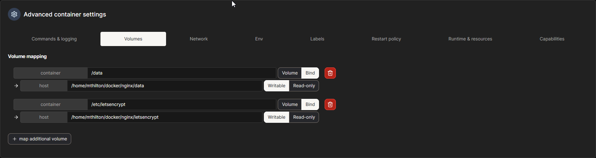
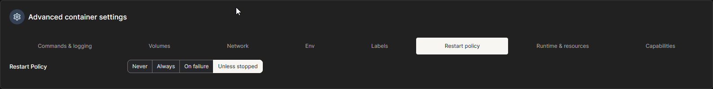
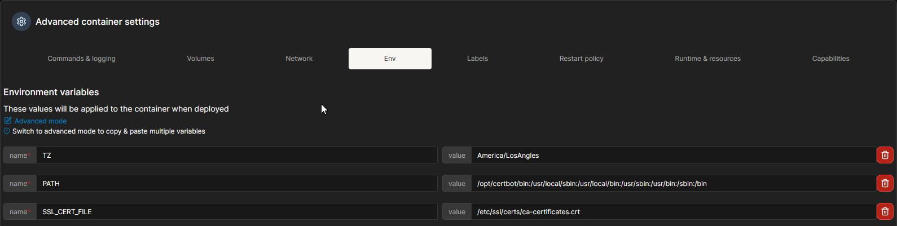

# Services

The following services are critical to the network stack, so I described them and their configuration in detail in other sections. To view these details click on any of the following services:

 - [Pi-Hole DNS](./Network.md#dns-stack)
 - [Unbound Recursive DNS](./Network.md#dns-stack)
 - [Wireguard](./Network.md#dns-stack)
 - [DHCP Windows Server 2022](./Network.md#dhcp)

## TrueNAS

TrueNAS is the my NAS software of choice. To be honest, the main reason I chose it was due to the cost and support for ZFS. Initally I wanted to build my storage pool up with a RAIDZ1 stripe. The main reason I didn't is because I knew I only had 2 drives and based on my research if I wanted to add two more drives in the future, my best bet would be to do a stripe of mirrors. 

Once TrueNAS was installed, the first thing I did was configure the networking. I ensured that my 2.5 gig card had a static ip address, that way in the DNS, I could set my own Name for the 2.5 gig link. This name will be what I use to access the SMB shares later down the line. 

After networking was comfigured, the next thing I did was create a Pool. This is how we aggragate all of our drives together. 

   1. In the Left-hand menu I clicked on `Storage`
   2. In the top-right of the `Storage` dashboard I clicked `Create Pool`
   3. Then I followed the steps in the Pool Creation Wizard

Most of the options like `encryption`, `hot-spare`, `L2 ARC-Cache`, etc I skipped over becuase I don't really have the hardware to do all of those things. I'm just looking for something basic for right now. 

Once you have your pool, then you need to create a `dataset`. This will be where we create our Samba Share. Why Samba? The main computers that i would be interested in backing up are Windows devices. SMB was designed with Windows in mind and is accessable by all major operating systems (MacOS, Windows, and Linux).

In the Dataset Manager dashboard just click `Add Dataset` and follow the on-screen prompts. Be sure to select SMB as the Dataset type. Once we create our SMB Share, next we have to create users that would be able to access these shares.

In the `Credentials` Tab on the left-hand side, Click on `users`. Then in the top right click `Add`. For my personal user, I made sure to add full access (SMB, TrueNAS, Shell, and SSH Access). I had to set a password and a Home Directory since I had SSH access. The Home direcrty gave me a bit of problems until I realized that I could just create a "home" folder in my SMB share. I also made sure my TrueNAS role was set to Full Access. At this point, I copied my SSH key for my desktop in order to access the shell from my desktop. The only other thing I did was set my UID that way I could make it the same across all of my Unix-like Services.

I created another user with the default password being `ch4ng3m3!` to remind me to change it later. This is just going to be a normal user, so they don't need access to the TrueNAS web interface, shell, or SSH access.

The last thing I did was actaully enable the SSH daemon in the `Services` tab under `System` in the left hand side. This is what will allow me to actually SSH into the VM should I need to. 

## Portainer

Portainer is very easy to get running. Basically you just follow the [documentation](https://docs.portainer.io/start/install-ce/server/docker/linux#docker-run). Essentially, [assuming docker is installed](./Virtualization-Containerizaion.md#containerization-with-docker), you are going to run the following command in order to create a volume for portainer to store data:

```bash
docker volume create portainer_data
```

Then using the cli you can run the following:

```bash
docker run -d -p 9443:9443 --name portainer --restart=always -v /var/run/docker.sock:/var/run/docker.sock -v portainer_data:/data portainer/portainer-ce:lts
```
   - `-d` to run in detached mode
   - `-p 9443:9443` the port to access the webGUI
   - `--name portainer` sets the container name to be portainer
   - `--restart=always` Docker will always try to start this container if it is stopped
   - `-v /path/on/host/:/path/in/continer` bind the path from the host into the path on the container.

 The first thing that will happen when we access the websties @ `<host-machine-ip>:9443` is a prompt for you to create a user account to manage Portainer. From here we can manage the rest of the containers that we make from Portainer.

## Nginx

In Portainer, go to your local docker instance. Then go to `Containers`. Click `Add Container`. Then we are going to add the following configurations. I have it here as a docker-compose file but I set this up using the GUI:

```yaml
services:
  app:
    container_name: nginex-proxy-manager
    image: 'jc21/nginx-proxy-manager:latest'
    restart: unless-stopped
    environment:
      TZ: "<your-unix-timezone>"
    ports:
      - '80:80'   # Public HTTP Port
      - '443:443' # Public HTTPS Port
      - '81:81'   # Admin Web Port
    volumes:
      - /path/to/host/nginx/data:/data
      - /path/to/host/nginx:/etc/letsencrypt
```
In Portainer, the `container_name` and `image` fields are here:



The `ports` section goes here:



Scrolling down to the `Advanced Container Settings`, we can bind our volumes in the `volumes` tab:



Also we can find the `Restart Policy` Section:



Finally we get to `Environment`. This section is where we can set the enviornment variables. In this image, you see the already complete container up and running. There are more variables that get loaded after the creation of the container. Just know that this is where you would put your env variables like the timezone:



## iVentoy

:construction: Still being Worked on :construction:

***
Return to [Readme](./README.md)