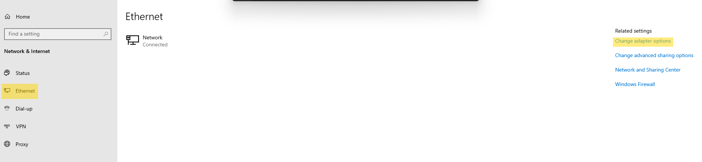

# Virtualizaion and Contaninerization

In this homelab, I utilize both virtualization and containerization. On the [9020](./Hardware.md#dell), the host OS is Proxmox. This hypervisor has three Virtual Machines: [TrueNAS](./Services.md#truenas), [Debian](#containerization-with-docker), and [Windows Server 2022](./Network.md#dhcp). TrueNAS contains all the volumes for mass storage. Debian is the host operating system for all of my Docker containers and the host that iVentoy is running on. Windows Server is for hosting my DHCP server.

## Virtualization with Proxmox

Before I installed Proxmox, I went into the BIOS of the [9020](./Hardware.md#dell) and ensured that the following options were selected:

```yaml
intel-VTd: Enabled       # Ensures Intel's Virtual platform is enabled
virtualization: Enabled  # Ensures Virtualization is enabled
NIC_Config: Enabled      # Ensures the Network interface card (NIC) is avalible at boot
```

Then once I had Proxmox installed, I added `intel_iommu=on` to the grub command line arguments. This way, I can pass the network card and HBA to the NAS VM. To make this changed I edited `/etc/default/grub`:

```yaml
GRUB_CMDLINE_LINUX_DEFUALT="quiet intel_iommu=on"
```

In my [DHCP server](./Network.md#dhcp), I set up a static IP address for this machine. Then in PiHole, I added a Local DNS record to give this server a URL that I could reach it by. Now we can access the web interface by going to `<Your-Proxmox-Url>:8006`

**Important:** In order to enable updates, we need to disable the enterprise components and enable the two no-subscription compenets. This way we can actually get updates if we did not pay for Proxmox. To change this, click on your server under Datacenter once you are signed into the Proxmox Web Interface. This can be changed in the `Updates` Tab. Click `Repos` and disable any URIs that say *enterprise* in the `Compnents` column. Then make sure to add the to analagus URIs where it says *no-subscription* in the `Compnents` column.

Finally I added my ssh key for my PC to the server and disabled SSH with Password Login. This way only verified ssh keys can access the server. To do so make the following changes to `vim /etc/ssh/sshd_config`:

```yaml
ChallengeResponseAuthentication: no
PasswordAuthentication:          no
UsePAM:                          no
```  

You can optionally prevent root login by setting `PermitRootLogin` to `No`. On this server I did not do that since I only have the root user account and there is no way to log into this computer without my ssh key. Furthermore this machine is not directly accessable from the web so in this case it should not be an issue. On all other servers I did set this option to no.

## Containerization with Docker

First we need to make the VM that will be the host for docker. While I am aware that Proxmox supports LXC contianers, I wanted to learn more about Docker. This is the reason I chose to use Docker inside a VM.

The Host OS for the VM is Debian. I chose debian becuase it was what the guide I was watching was doing. However, debian is a good choice because its pretty bare-bones but it widely suported.

### Binding the SMB Share

After Debian was installed I made sure to set a static IP in my DHCP server and make a Local DNS record for this VM. Then I copied my ssh key and disabled SSH w/ password. Next I installed a few utilites (cifs-uitls, curl, ca-certificates) using apt. These utilites will allow me to mount my Samba Share from TrueNAS when the VM boots.

First there are a few files that we should prepare:

   1. A Credentials file: This will allow us to hide our log in credentials for the SMB share.
   2. A Custom Systemd Script: This script ensures that we do not attempt to mount the SMB share until after we establish a connection to the NAS.

For the credentials file, we want to have the following information:

```bash
user=<Samba-Username>
pass=<Password-for-Samba-User>
```

We can save this as a dotfile in the `/root/` directory. Then we can use the following command to make it read-only by root: `chmod 400 /root/path/to/credentials/`. This will prevent anybody from being able to access the password without becoming root.

For the Systemd Script, we want to create a service that will ping our NAS once a second until we actually get a reply. We can make a service called `wait-for-ping.service` in `/etc/systemd/system/`. [This is the script](scripts/wait-for-ping.service).

Once we have these files, we are ready to mount the Network Share. We are going to update our `/etc/fstab` file that is responsible for getting drives mounted in the right place. At the end of your `fstab` file you will add the following:

```bash
//ip-for-NAS/Name-of-share /path/to/share cifs vers=3,credentials=/path/to/.smbcredentials,uid=<your-uid>,forceuid,gid=<your-guid>,forcegid,noauto,_netdev,x-systemd.automount,x-systemd.after=wait-for-ping.service 0 0
```

- `//ip-for-NAS/Name-of-share`: IP or DNS name of NAS then the name of the share on the NAS
- `/path/to/share`: path on your local machine that you would like to mount the share to. Make sure that it is an empty directory.
- `cifs`: the filesystem we are to mount. In this case we are using cifs becuase this is a samba share.
- `vers`: Verison of cifs to use, we use verison 3 becuase it has some added support for the options we are using.
- `credentials`: path the the credentials file that we made earlier
- `uid, gid`: Your userID and GroupID for the share. This is set when you create the user for this share.
- `forceuid/gid`: requires the share to be mounted with the permissions of the uid/gid
- `noauto`, `x-systemd.automount`: changes the auto mount to happen when systemd does it. This allows us to use our custom ping service.
- `_netdev`: ensures that we have networking before this atempts to run
- `x-systemd.after=wait-for-ping.service`: our custom service that prevents the VM from finishing boot until we can ping our NAS. This ensures that we always have our NAS for our docker containers.

Now we need to reboot for the drive to be mounted. Now we can install Docker.

### Installing and Configuring Docker

For info on how to install we can go to the [docker installer](https://docs.docker.com/engine/install/debian/). We will ensure that there are no conflicting packages using the following command:

```bash
sudo apt remove $(dpkg --get-selections docker.io docker-compose docker-doc podman-docker containerd runc | cut -f1)
```

Next we need to add dockers GPG keys:

```bash
sudo install -m 0755 -d /etc/apt/keyrings
sudo curl -fsSL https://download.docker.com/linux/debian/gpg -o /etc/apt/keyrings/docker.asc
sudo chmod a+r /etc/apt/keyrings/docker.asc
```

Finally, add the docker repo to apt's srcs so we can get updates:

```bash
sudo tee /etc/apt/sources.list.d/docker.sources <<EOF
Types: deb
URIs: https://download.docker.com/linux/debian
Suites: $( /etc/os-releases && echo "$VERSION_CODENAME")
Components: stable
Signed-By: /etc/apt/keyring/docker.asc
EOF
```

Then we are ready to install docker:

```bash
sudo apt update
sudo apt install -y docker-ce docker-ce-cli containerd.io docker-bildx-plugin docker-comose-plugin
```

Once apt is complete we just need to verify that it works by running the hello world container and adding your user to the docker group.

```bash
sudo docker run hello-world         # Runs the Hello World container
sudo usermod -aG docker <your-user> # Adds your user the docker group
```

## Windows Virtualization in Proxmox

First and foremost: why are we installing windows? Most of the IT world revolves around AD and Windows serve. This means its a good thing to host even if there isn't anything in particular that you want to do with it. Now as I discuss later in the [Networking](./Network.md#dhcp-servers) section, this is the easiest way to set up network boot without swapping out my hardware router with something like openSense, pfSense, or flashing my current router.

The downside to this is that Windows, doesn't like being the center of attention. It expects to be on bare metal, so much so that there is a whole section on the proxmox wiki to Windows 20xx best practices.

### Step 1a - Prepairing to install Windows Server

The following is pulled straight from the [Proxmox Wiki](https://pve.proxmox.com/wiki/Windows_2022_guest_best_practices).

Just like with the other images on proxmox, we need to make the new VM and mount the ISO in the CDROM Drive. We specifically want to make our Virtual Hard Disk (VHI) `SCSI` as the bus with `VirtIO SCSI single` as controller. We should set `write back` as cache and mark `Discard` to enable TRIM. Finally, we should enable IO Thread. A little later you will want to set `VirtIO (paravirtualized)` as the network device. Everything else should be business as usual.

The next thing we need to prepare the VirtIO drivers for the network and the drive. Without these drivers, we will be unable to install the image or have networking. You can find the [drivers here](https://pve.proxmox.com/wiki/Windows_VirtIO_Drivers#virtio-win_Releases). Once the drivers are downloaded, we will need to create a second CD-ROM drive. This drive must be set up with `BUS` set to `IDE` and `number` set to 0. Then we can load the drivers into the CD-ROM drive.

### Step 1b - Installing Windows Server

Now we can actually boot the VM. Once we start the VM, we will want to select `Custom (advanced)` installation type. Then, you will see that Windows will ask you to where to install the OS. You should see a blank list. This is due to the fact that Windows will need those drivers we prepared eariler to be able to utilize the VirtIO disk that we made for this VM. At the bottom of this screen we can select `Load Driver` to install the proper drivers. There are three total drivers that we will be installing:

| Device | Location | Description |
| ------ | -------- | ----------- |
| Hard Disk | vioscsi\2k22\amd64 | VirtIO Hard Disk |
| Network | NetKVM\2k22\amd64 | VirtIO Network |
| Memory Balloning | Balloon\2k22\amd64 | Enables [Memory Ballooning](https://en.wikipedia.org/wiki/Memory_ballooning) in the kernel |

Now we will be able to install to the virtual drive. Finish the install, set up the administator user. Now once we are in OS, we can set up a few more drivers. In the same driver disk, we can install the `Guest Agent` located under `guest-agent\qemu-ga-x86_64.msi`. After that we can run the `virtio-win-gt-x64.msi` in the root of the disk. These two drivers will provide correct usage information in the `Summary` page of the vm. Lastly, we can check `Device Manager` for any drivers that were not already installed. Search for anything that has unknown drivers, select `Update Driver`, `Browse my computer for driver software`, then select the driver cd. Be sure to select the include subforlds checkbox. Then install the driver. At this point go into proxmox and remove the disk. Restart the VM.

### Step 2 - Basic Configuration

#### Setting a Static IP address

In every video I watched about setting up Windows Server 20xx, the first thing everybody did after install was set their IP address. Even though we configured a reservation on the router's DHCP server, the whole point was to make this host our DHCP server. To set our IP click on the `Network` icon in the Task Bar. Then click `Network and Internet Settings`. Click on `Ethernet` in the side bar, then click on `Change adapter options`.



Next we are going to right click on the Red Hat VirtIO Ethernet Adapter and select Properties. Then we are going to click on `Internet Protocol Version 4` and click on properties. A window will pop up where we can set the IP Address, Subnet Mask, Default Gateway, and DNS server. Click `OK` to save the configuration.

#### Setting the Hostname

Next we are going to change the Hostname. A best practice for hostnames on Windows Servers is something to the effect of `your-server-name-DC##`. Typically, we will use Windows Server to be our Domain Controller. I do not actually want to make a domain and manage it with this server so I will avoid this naming scheme myself. At any rate, we will open `Server Manager` and on the left hand side we will select `Local Server`. We will click on Computer name and click `Change`. This will allow us to change the hostname on the system.

#### Creating a User

While we can log into this machine with the Administrator account, its a best practice to sign in with a different user. To do this, we should open `Server Manager`, then in the top right tool bar we can click `Tools` then `Computer Management`. Next we will expand `Local Users and Groups`, right click on the `Users` OU and select `New User`. We can fill in the information on Name, Username, Description. Make sure to set a password here. If you would like you can make your password never expire. Once everything is set up you can click on `create`.

After you create your user, you probably want to add it to the Administrators group. To do so, we can click on the `Groups` OU, then we can select `Administrators`. The properties window will pop up and we can click `Add`. We can leave most of the options as default, however, we should add our username in the `object names` field. We can click `Check Names` and it should automatically correct our username to something in this format: `hostname\username`. Then we can hit okay and that will add that user to the Administrators group.

Once that is complete an optional step is to reboot the VM, logging in as the new user and administator. If we do this we can go back to `Computer Management` > `Local Users and Groups` > `Users` and disable all accounts other than the one you just created. To do this, double click on the user, check the `Account is Disabled` Checkbox. This will disable the given account.

#### Enabling Remote Desktop Protocol (RDP)

While the noVNC clients work well enough, they tend to be a bit laggy. Something that works very well is Windows Remote Desktop Protocl (RDP). To enable, we cna make are way to `Server Manager` and on the left hand side we will select `Local Server`. We can click on `Remote Desktop` and then select the option `Allow remote connections to this computer`. Next we are going to click on `Select Users`. We can click add and use the same flow to add our user to the Administrators group. This step is not stricly required; administrators already have permission to use remote desktop. However, I feel its better to explicitly add the user to the Remote Desktop Users group. Now we can use RDP on Windows Machines or the Windows App on non-windows machines to remote in.

### Step 3 - Advanced Configuration

#### Set up SSL for RDP - ***Optional***

One thing that you will notice right away is that you will get a warning about a self-sign certificate when you try and remote into this server. However, we already have DuckDNS set up to give us valid certificates. We just need to grab the certificate, install it into the certificate store, and then use that certificate for RDP. Most of this can be done using Posh-ACME (Which I assume stands for Powershell-ACME). Win-ACME seems to be more popular, however, there was a plugin for DuckDNS on Posh-ACME, that is why I ultimatly chose it.

First, we need to install Posh-ACME. We cn use `PSGet` in order to install. Run Powershell as an administrator. Then:

```powershell
Install-Module -Name Posh-ACME -Scope AllUsers
```

This will install Posh-ACME. Once installed, we will need to do the following:

Set the ACME server:

```powershell
Set-PAServer LE_STAGE # Staging Server, use this for testing.
Set-PAServer LE_PROD  # Production Server, use this for your actual deployment.
```

> [!NOTE]
> The next bit is going to focus on the DuckDNS Setup. If you are using a different Dynamic DNS provider, please refer to the [plugins](https://poshac.me/docs/v4/Plugins/) Page. You should see your plugin and its requirements there.

Store your DuckDNS secret in a safe place:

```powershell
"Duck-DNS-Secret" | ConvertTo-SecureString -AsPlainText -Force | ConvertFrom-SecureString | Out-File "C:\path\to\secret.txt"
$PfxPassword = Get-Content "C:\path\to\secret.txt"
```

> [!NOTE]
> Here I plan to encrypt my Pfx file using the encrypted secret as the key. This is why I set up this variable.

Set up your first certificate:

```powershell
$DuckDNSArgs = @{
   DuckToken = ConvertTo-SecureString $PfxPassword
   DuckDomain = <your-subdomain>
}

New-PACertificate "*.<your-subdomain>.duckdns.org" `
   -UseSerialValidation `               # Names are Validated individually, req'd for DuckDNS
   -AcceptTOS `                         # Agrees to the TOS
   -Contact "your-contact@email.com" `  # Contact Email
   -Plugin DuckDNS `                    # Select your plugin
   -PluginArgs $DuckDNSArgs `           # Args req'd for your plugin
   -PfxPassSecure $SecuredToken `       # SecureString Obj used to encrypt your Pfx File
   -Install                             # Automatically install in Windows Certificate Store
```

You now have your Certificate! We still need to swap out the thumbprint from the self-sign cert to the current one. We can do that by heading into the Certificate store (`Start Menu` > `run` > `certlm.msc`). Then Click on the arrow next to `Personal` click `Certificate` double click on the wildcard certificate. Go to the Details tab and scroll down to Thumbprint. Copy the thumbprint. Then in PS run the following:

```powershell
# This will grab the current certificate
$CurrentCert = Get-CimInstance `
   -Namespace root\cimv2\TerminalServices `
   -ClassName Win32_TSGeneralSetting `
   -Filter "TerminalName='RDP-Tcp'"

# Then we motify the object with the new Thumbprint
Set-CimInstance `
   -InputObject $CurrentCert `
   -Property @{ SSLCertificateSHA1Hash = 'your-thumbprint' }

# Finally we restart the RDP Protocol
Restart-Service -Name TermService -Force
```

When you go to RDP you will not be hit with another Self-Sign cert error!

#### Automate Certificate renewal - ***Optional***

Now that we have that certificate, it will expire after some amount of time. Here is a script that will refresh the Certificate using the `Submit-Renewal` command. If it returns a new certificate, we should do the thumbprint replacement process. The [script](scripts/UpdateSSL.ps1) is in the scripts folder of this repository. Here I will just describe the automation process.

First, we want to create a new Event so we can log what happens in the Event Log:

```powershell
New-EventLog -LogName Application -Source UpdateRdpSsl
```

Then we can open up Task Scheduler. First, we Create a new Task from the `Create Task` option in `Actions` Pane on the right hand side.

In the `General` tab:

- Name the Task
- Change the User to `System`
- Check `Run with Highest Privileges`

In the `Triggers` tab:

- Create a new trigger
- Set it to run daily
- Set `Delay task for up to (random delay)` to 1 hour
- Set `Stop Task if it runs for longer than:` to 1 hour
- Ensure that `Enabled` is checked
- Set the time for 6:01 AM.
- Repeat the steps above except change the time to 6:02 PM.

In the `Actions` Tab:

- Create a new action
- Set Program/script to be Powershell

> [!NOTE]
> If you have Powershell 7+ you should set that here. Otherwise, just set it to be the powershell that is in the System32 folder.

- Add the following Arguments:

```powershell
-NonInteractive -NoProfile -ExecutionPolicy Bypass -File "C:\path\to\script.ps1"
```

In the `Conditions` Tab:

- Uncheck `Stop if the computer switches to battery power`
- Enable `Wake the computer to run this taks`
- Enable `Start only if the following netowkr connection is avalible` and select your network adapter

That is it, it is all set to go!

***
Return to [Readme](./README.md)
